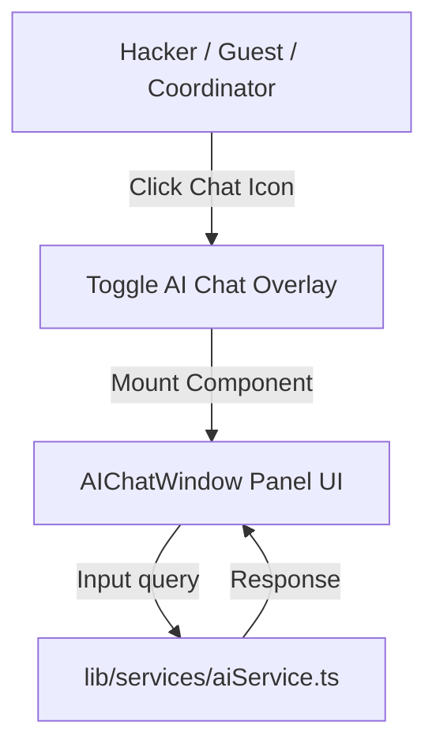

# 🤖 AI Assistant Subsystem

This document describes the design, integration strategy, matching logic, and styling of the floating interactive AI Assistant.

---

## 🤖 Layout Integration & Floating Button

The AI Assistant is globally available. The trigger button floats in the bottom-right corner of all routes inside `/app/layout.tsx`.



To optimize the initial landing page bundle size, the Chat Window is loaded dynamically:
```typescript
const AIChatWindow = dynamic(
  () => import('@/components/ui/AIChatWindow'),
  { ssr: false }
);
```

---

## 🏎️ Client-side Knowledge Matching Engine

Since the assistant runs on client browsers without active server LLM calls, it uses a lightweight matching engine in `lib/services/aiService.ts`:

1. **Standard Normalization**: Lowercases the input query and removes punctuation.
2. **Intent Keyword Checking**: Scans words for topics:
   - **`wifi` / `internet`**: Returns SSID details and login instructions.
   - **`schedule` / `timeline`**: Outputs start times, submission locks, and ceremony schedules.
   - **`food` / `lunch` / `dinner`**: Provides catering schedules and vegetarian options.
   - **`submission` / `deadline`**: Explains Devpost links and rules.
   - **`qr` / `checkin`**: Directs participants on how to check in.
3. **Fuzzy Fallback Response**: Returns fallback instructions indicating support channels and volunteers.

---

## 🎬 Chat Window Animations

To provide a premium experience:
* **Opening Chat**: The chat bubble expands outwards using a Framer Motion bounce transition (`type: "spring", stiffness: 300, damping: 25`).
* **Message Load**: Text entries slide upwards and fade in sequentially:
  ```typescript
  const messageVariants = {
    initial: { opacity: 0, y: 10 },
    animate: { opacity: 1, y: 0 },
  };
  ```
* **Status Glow**: The pulsing indicator shows when the virtual assistant is active.
