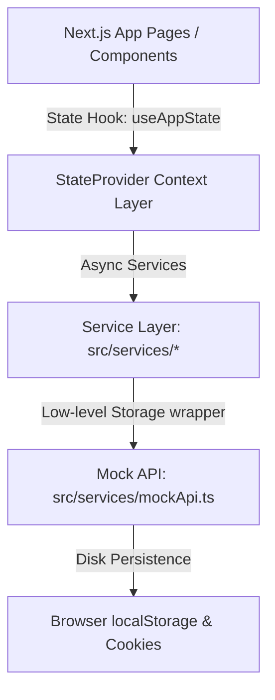
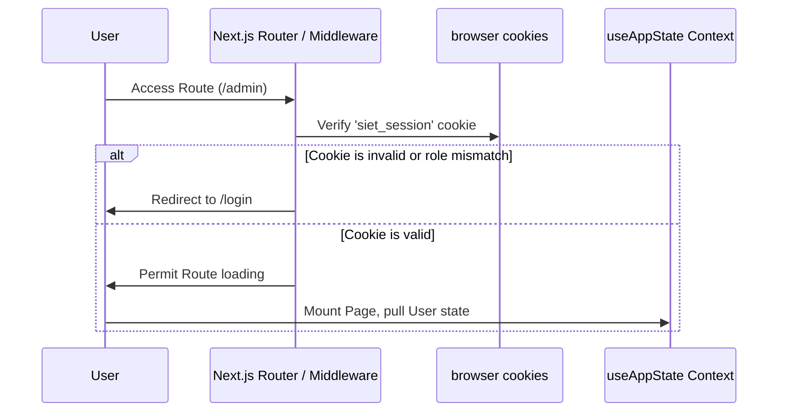
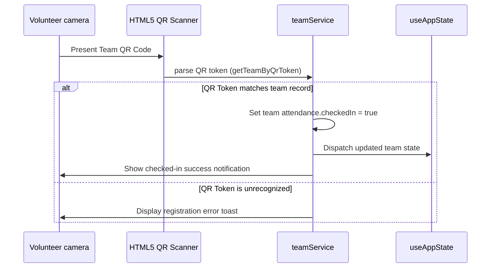

# 🌐 Architecture Overview & Folder Mapping

This document describes the design principles, structural composition, folder responsibilities, and data flows of the SIET AI Hack Lab Platform.

---

## 🏛️ System Architecture Design

The platform uses a **frontend-first, fully simulated backend architecture**. Since this is a production-ready, client-interactive prototype designed to run without active server components, all database state and service layers are simulated directly inside browser storage (`localStorage` and HTTP cookies) via synchronous and asynchronous service wrappers.



---

## 📁 Repository Structure Mapping

Below is the directory structure layout and the corresponding engineering responsibility for each node:

```
├── .github/                 # GitHub collaboration standards (templates, workflows)
├── app/                     # Next.js App Router pages and page-level layouts
│   ├── admin/               # Admin portal page
│   ├── dashboard/           # Team/Participant dashboard portal page
│   ├── judge/               # Judge grading evaluation portal page
│   ├── login/               # Authentication credentials portal page
│   ├── organizer/           # Organizer control desk portal page
│   ├── register/            # Team and participant signup pages
│   ├── volunteer/           # Volunteer support and ticket portal page
│   ├── layout.tsx           # Main application root layout containing providers
│   └── globals.css          # Styling entrypoint utilizing Tailwind CSS v4 variables
├── components/              # Reusable UI component blocks
│   ├── cards/               # Complex cards (FAQ, features, metrics)
│   ├── layout/              # Navbars, Sidebars, and StateProvider wrappers
│   └── ui/                  # Atom-level layout blocks (AIAssistant, dialogs, buttons)
├── docs/                    # System engineering specifications and ADRs
│   └── adr/                 # Architecture Decision Records index
├── lib/                     # Client utilities and shared helpers
│   ├── mockData.ts          # Static seeding data for initial runtime
│   └── services/            # Client utility services (e.g. aiService)
├── src/                     # API Simulation and storage persistence
│   ├── services/            # LocalStorage-based simulated endpoints
│   └── types/               # Simulated API request/response type contracts
├── types/                   # Shared types across client UI components
└── package.json             # Build configurations and dependency definitions
```

---

## 🔄 Component Responsibility Matrix

| Component Layer | Primary Location | Responsibility |
| :--- | :--- | :--- |
| **Routing & Pages** | `/app` | Page shell mounting, path-based access control, role-based layout checks |
| **Shared Layouts** | `/components/layout` | Shared navigation headers, responsive role-based sidebar menus, global theme switches |
| **Atomic UI Elements**| `/components/ui` | Abstracted modal popups, interactive scan buttons, unified AI chat shells |
| **Context Providers** | `/components/layout/StateProvider.tsx` | Global React context hook (`useAppState`) managing state syncing and updates |
| **Endpoint Simulators**| `/src/services` | Storing, querying, and updating virtual records in browser local storage |

---

## 🏎️ Core Data Flows

### 1. Authentication Check & Redirection Flow


### 2. QR Verification & Attendance Marking Flow

