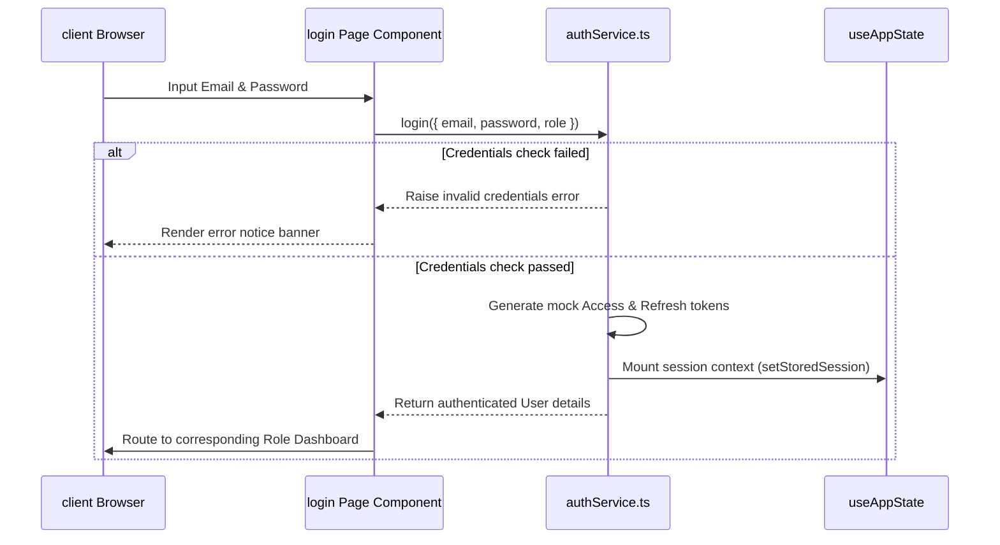

# 🔒 Authentication & Credentials

This document covers testing credentials, authorization flows, and state synchronization within the authentication system.

---

## 🔑 Test Accounts Configuration

To allow developers and QA testers to log in and inspect individual dashboards immediately, the platform seeds simulated credentials inside `/lib/mockData.ts` and caches them to browser storage during initialization.

| Role | Username / Email | Password | Allowed Dashboards |
| :--- | :--- | :--- | :--- |
| **Admin** | `admin@siet.edu` | `admin123` | `/admin` |
| **Organizer** | `organizer@siet.edu` | `organizer123` | `/organizer` |
| **Judge** | `judge@siet.edu` | `judge123` | `/judge` |
| **Volunteer** | `volunteer@siet.edu` | `volunteer123` | `/volunteer` |
| **Participant** | `participant@siet.edu` | `participant123` | `/dashboard` |

---

## 🔄 Authorization & Sign-In flow

The authentication system simulates standard workflows using localStorage:

---

## 🍪 Middleware Sync & Route Protection

On login success, `authService` stores cookie keys (`siet_session`) with short expirations to allow Next.js app router middleware (`/middleware.ts`) to intercept navigation requests and restrict entry to dashboard paths based on active roles.
On logout, the cookie and local storage variables are deleted, sending the browser back to `/login`.
