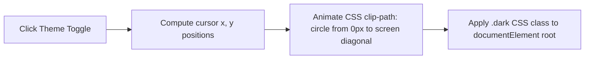

# 🏎️ Frontend Architecture & View Optimization

This document outlines the frontend layout strategies, styling structures, micro-animations, lazy loading strategies, and performance frameworks of the SIET AI Hack Lab Platform.

---

## 🎨 Styling Architecture (Tailwind CSS v4 & Vanilla CSS)

The styling architecture leverages **Tailwind CSS v4**'s native `@theme` directives configured in `/app/globals.css` combined with vanilla CSS layers for custom scrollbars and backdrop filters (glassmorphism).

### Glassmorphism Template
All primary UI containers (portals, forms, modals, and headers) utilize glassmorphism to establish a premium, high-fidelity dark-mode user experience:
```css
.glass-container {
  background: rgba(17, 24, 39, 0.7);
  backdrop-filter: blur(12px);
  border: 1px solid rgba(255, 255, 255, 0.08);
}
```

---

## ⚡ Lazy Loading & Optimization Strategies

To ensure a high-performance landing page experience (stable 60 FPS) and avoid bundling bulky rendering engines like `html5-qrcode` or custom JSON parsers on first load, the platform utilizes dynamic, on-demand imports:

```typescript
// Lazy loading the camera scanning window only when requested by a volunteer
const QRScannerComponent = dynamic(
  () => import('@/components/ui/QRScannerComponent'),
  { ssr: false, loading: () => <ScannerLoadingSkeleton /> }
);
```

---

## 🌀 Theme switching (Circular Reveal Transition)

The platform supports dark and light modes. To give a premium, organic feel, the theme toggle trigger initiates a custom canvas-based circular expand animation.



---

## 🎬 Animation System (Framer Motion Configs)

To maintain structural consistency, the application groups standard transitions into reusable configuration objects:

### Page Entrance Transition
Applied to portal main pages on route load:
```javascript
export const pageTransition = {
  initial: { opacity: 0, y: 15 },
  animate: { opacity: 1, y: 0 },
  exit: { opacity: 0, y: -15 },
  transition: { duration: 0.35, ease: "easeInOut" }
};
```

---

## 📱 Responsive Layout & CSS Breakpoints

The design scales dynamically across mobile devices, tablets, and desktop displays:

* **Mobile (`< 768px`)**: Drawer navigation menus, stacking flex cards, full-width modal drawers, hidden sidebars.
* **Tablet (`768px - 1024px`)**: Grid compression, icons-only sidebar, collapsing filter menus.
* **Desktop (`> 1024px`)**: Full sticky dual column sidebars, multi-paned tabular forms, persistent floating widgets.
