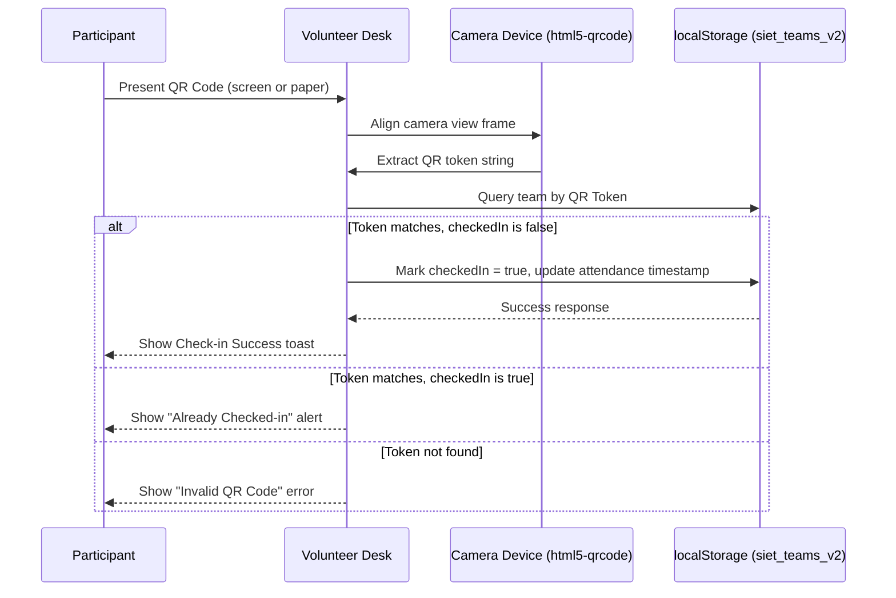

# 🎫 QR Code Check-in & Scanning System

This document outlines the QR code generation structure, scan lifecycles, and check-in workflows.

---

## 🎫 QR Code Format Structure

To support fast offline ticket scanning and prevent data tampering, the platform generates unique encrypted string tokens for each registered team:

```
[Team Prefix]-[Platform Tag]-[Sequence ID]-[Security Hash]
```

### Example Token
```
AI-AI26-105-SEC4F9B3
```
* **Team Prefix (`AI`)**: Derived from the team's name.
* **Platform Tag (`AI26`)**: Identifies the event (AI Lab Hackathon 2026).
* **Sequence ID (`105`)**: Unique team index ID.
* **Security Hash (`SEC4F9B3`)**: Random string preventing brute-force token generation.

---

## 🔄 Check-in Lifecycle Workflow



---

## 📷 Camera Integration & Scanner Component

The volunteer camera view leverages the **`html5-qrcode`** package to interface with device cameras.
* **Scanning Resolution**: Configured to `640x480` for instant frame processing on mobile devices.
* **Orientation Support**: Detects and switches between front and rear cameras automatically.
* **Fallback UI**: If camera access is denied, volunteers can manually input the QR token string to verify attendance.
