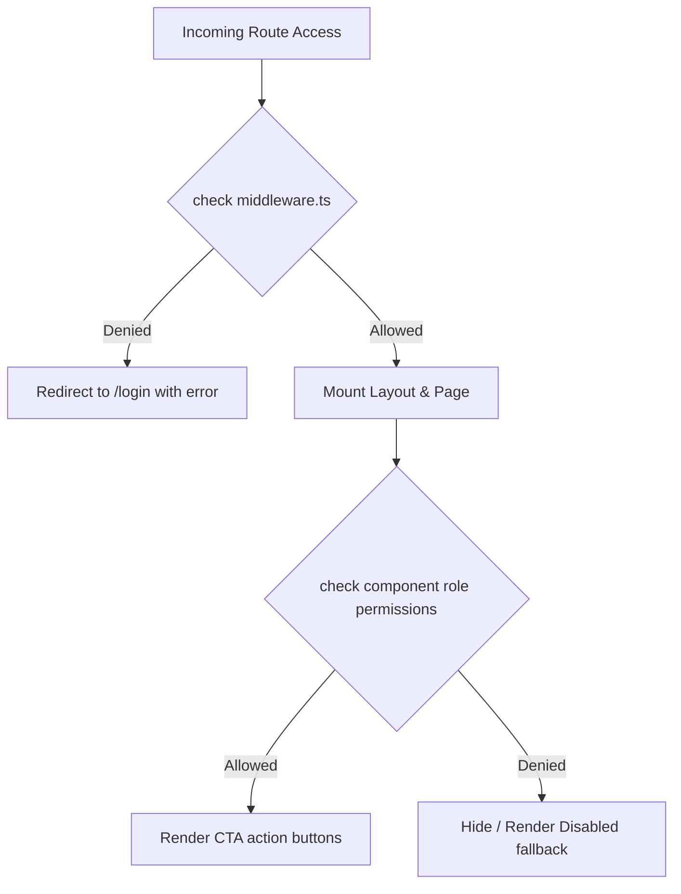

# 🔑 Role & Permissions Matrix

This document maps user roles to dashboard entries, functional workflows, and data permissions.

---

## 👥 Roles Defined

The platform supports five specialized roles:

1. **Participant (`participant`)**: Hacker checking in, forming teams, submitting projects, generating check-in QR codes.
2. **Judge (`judge`)**: Tech evaluator scoring submissions and supplying constructive reviews.
3. **Volunteer (`volunteer`)**: Admin assistant scanning attendee QRs, monitoring ticket requests, clearing check-ins.
4. **Organizer (`organizer`)**: Coordinator managing event timelines, reviewing teams, pushing public notices.
5. **Admin (`admin`)**: Superuser possessing full control over configurations, role swaps, and audit trails.

---

## 🗺️ Portal Navigation & Routes Matrix

| Role | Dashboard Route | Allowed Workflows | Excluded Panels |
| :--- | :--- | :--- | :--- |
| **Participant** | `/dashboard` | Update Profile, Form Team, View Submissions, Show QR Code | Judge Grading, Volunteer Desk, System Logs |
| **Judge** | `/judge` | View Assigned Teams, Score Projects, Submit Reviews | Attendee Check-in, System Logs, Timeline Modifiers |
| **Volunteer** | `/volunteer` | Scan Attendee QR Codes, View Support Tickets, Resolve Alerts | Modify Grades, Global Settings, System Logs |
| **Organizer** | `/organizer` | Review Registration Statuses, Broadcast Announcements, Manage Schedules | Modify Grades, System Logs, Direct Database Mutations |
| **Admin** | `/admin` | Modify System Configs, System Log Inspection, Override Database States | Direct Submission Grading (unless assigned as Judge) |

---

## 🔒 Permission Enforcement Model

Access control is enforced at two stages:
1. **Middleware Level (`/middleware.ts`)**: Checks active HTTP cookie credentials and redirects users attempting to access unauthorized folder structures.
2. **Component Level (`StateProvider`)**: Limits action buttons (e.g. "Mark Scored" or "Approve Team") to users with matching authenticated sessions.

